# 海洋エクマン層シミュレーター

風が海面を東へ押しても、海は東へは流れない。
地球の自転は海流を進む方角に対して 90° 右側へ引っ張り（南半球では左へ）、
風と海流の向きの角度差は深くなるほど右へずれていく。
このリポジトリでは、V. W. Ekman が 1905 年に導いたこの螺旋構造をブラウザ上で数値的に解き、
**数値解が物理的に正しいことを検証する**。

**リポジトリ:** https://github.com/TomomuneNishino/ekman-spiral-solver

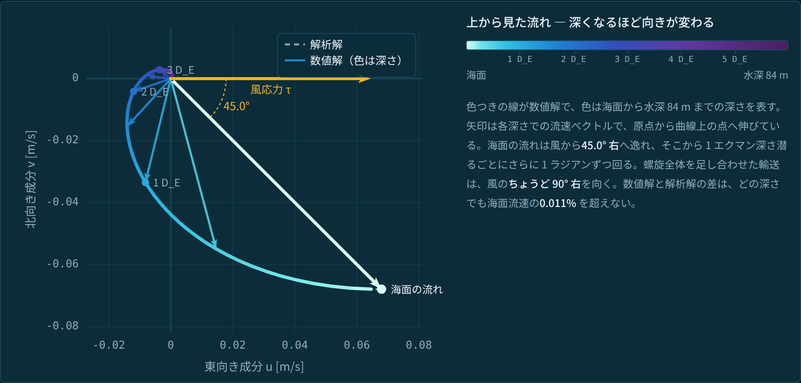

---

## 目次

- [0. 序論](#0-序論)
- [1. 解く方程式](#1-解く方程式)
  - [1.1 記号の定義](#11-記号の定義)
  - [1.2 運動方程式](#12-運動方程式)
  - [1.3 複素数を使うと 1 本になる](#13-複素数を使うと-1-本になる)
  - [1.4 境界条件](#14-境界条件)
  - [1.5 なぜ鉛直 1 次元の問題になるのか](#15-なぜ鉛直-1-次元の問題になるのか)
  - [1.6 解析解 — エクマン螺旋](#16-解析解--エクマン螺旋)
- [2. 数値解法](#2-数値解法)
  - [2.1 空間の離散化 — スタガード有限体積](#21-空間の離散化--スタガード有限体積)
  - [2.2 風応力を「界面フラックス」として与える](#22-風応力を界面フラックスとして与える)
  - [2.3 時間積分 — なぜ陰解法なのか](#23-時間積分--なぜ陰解法なのか)
  - [2.4 精度の次数について](#24-精度の次数について)
  - [2.5 領域の深さ `H` をどう扱うか](#25-領域の深さ-h-をどう扱うか)
- [3. 結果](#3-結果)
  - [3.1 定常エクマン螺旋](#31-定常エクマン螺旋)
  - [3.2 立ち上がりと慣性振動](#32-立ち上がりと慣性振動)
  - [3.3 エネルギー収支](#33-エネルギー収支)
  - [3.4 エクマン湧昇](#34-エクマン湧昇)
- [4. 検証](#4-検証)
  - [4.1 検証方針](#41-検証方針)
  - [4.2 保存則の検証](#42-保存則の検証)
  - [4.3 離散化の収束次数（`Δz`, `Δt` → 0）](#43-離散化の収束次数δz-δt--0)
  - [4.4 領域の深さの影響（`H` → ∞）](#44-領域の深さの影響h--)
  - [4.5 物理的性質の確認](#45-物理的性質の確認)
  - [4.6 検証結果一覧（20 項目、すべて合格）](#46-検証結果一覧20-項目すべて合格)
- [5. 動かし方](#5-動かし方)
- [6. ファイル構成](#6-ファイル構成)
- [7. AI の利用について](#7-ai-の利用について)
- [8. 参考文献](#8-参考文献)
- [付録 A. エネルギー収支 (2.3) の導出](#付録-a-エネルギー収支-23-の導出)
- [ライセンス](#ライセンス)
---

## 0. 序論

1893 年、Fridtjof Nansen は船ごと北極海の氷に閉じ込められて漂流する探検を行った。
このとき彼は、船が風下へまっすぐ流されるのではなく、
**風向きから 20〜40° ほど右へずれて**漂うことに気がついた。
これは、北極から見て反時計回りに回転する北半球では、
物体の進む方向に対して 90° 右側に**コリオリ力**という見かけの力が働くためである（南半球では左側）。

こうして海面付近の海水の層では風の向きから右にずれた流れが生じるが、
この層もまた直下の海水の層を押している。
引き摺られた下の層は、コリオリ力のため上の層より更に右側に流れがずれる。
これが深さ方向に積み重なった結果、螺旋状の流速場 ― エクマン螺旋 ― が生じる。

---

## 1. 解く方程式

### 1.1 記号の定義

本稿で用いる記号の定義を以下の表に示す。

| 記号 | 意味 | 単位 |
|---|---|---|
| `t` | 時刻 | s |
| `x` | 水平座標（東向きを正） | m |
| `y` | 水平座標（北向きを正） | m |
| `z` | 鉛直座標（**上向きを正**、海面が `z = 0`、深いほど負） | m |
| `u` | 流速の東西成分（東向きが正） | m/s |
| `v` | 流速の南北成分（北向きが正） | m/s |
| `ρ₀` | 海水の密度。一定とみなす（1025 kg/m³） | kg/m³ |
| `Ω` | 地球の自転角速度（7.2921×10⁻⁵ rad/s） | rad/s |
| `φ` | 緯度 | — |
| `f` | コリオリ係数。`f = 2Ω sin φ`。北半球で正、南半球で負 | rad/s |
| `ν_z` | 鉛直渦粘性係数（次項で説明） | m²/s |
| `τ_x, τ_y` | 海面に働く風応力の東西・南北成分 | N/m² |
| `τ_xz, τ_yz` | 深さ `z` での鉛直せん断応力 | N/m² |
| `H` | 計算領域の深さ | m |
| `D_E` | エクマン深さ（式 1.9 で定義） | m |
| `N` | 鉛直方向の格子数 | — |
| `Δz` | 格子幅 `= H / N` | m |
| `Δt` | 時間刻み | s |

**渦粘性係数 `ν_z`:** 海水そのものの粘性（分子粘性）は約 10⁻⁶ m²/s と極めて小さく、
観測されるエクマン層の厚さを説明できない。実際に鉛直方向の運動量輸送に寄与するのは乱流の渦であり、
その効果を粘性のように扱ったものが渦粘性係数である。
海洋表層では 10⁻³〜10⁻¹ m²/s 程度が使われる。ここではデフォルト値を 10⁻² m²/s とした。

**風応力 `τ`:** 風が海面を引きずる力を、単位面積あたりの力として表したもの。
中緯度で 0.1 N/m² 程度である。

### 1.2 運動方程式

水平スケールが十分大きく、密度成層と水平圧力勾配を無視できる状況を考える。
このとき水平方向の運動方程式は次の 2 本になる。

**東西方向（東向きが正）**

$$
\rho_0 \frac{\partial u}{\partial t} = \frac{\partial \tau_{xz}}{\partial z} + \rho_0 f v
\qquad (1.1)
$$

**南北方向（北向きが正）**

$$
\rho_0 \frac{\partial v}{\partial t} = \frac{\partial \tau_{yz}}{\partial z} - \rho_0 f u
\qquad (1.2)
$$

各項の意味は次のとおり。

- 左辺は**単位体積あたりの運動量の時間変化**。
- 右辺第 1 項は**せん断応力の鉛直勾配**。ある深さの薄い水の層に注目すると、
  上面から受ける応力と下面から受ける応力の差だけ、その層の運動量が増減する。
  応力そのものではなく応力の**差**が効くので、微分の形になる。
  この項はもともと応力テンソルの発散
  `∂τ_xj/∂x_j = ∂τ_xx/∂x + ∂τ_xy/∂y + ∂τ_xz/∂z` であり、
  水平一様（§1.5）のため `∂/∂x = ∂/∂y = 0` となって鉛直の 1 項だけが残ったものである。
  `τ_xz` を「東西成分の運動量が鉛直方向に運ばれる量（運動量フラックス）」と読み替えると、
  発散が取られているのは力の向きではなく**運動量が運ばれる向き**だと分かる。
- 右辺第 2 項が**コリオリ力**。式 (1.1) に `+f v`、式 (1.2) に `−f u` が現れる形は、
  力が速度ベクトルに常に直交していることを意味する。北半球（`f > 0`）で右向きになる。

**左辺が偏微分でよい理由**：流体の運動方程式の左辺は、本来は流体粒子に乗って測った加速度、
すなわち物質微分である。

$$
\frac{Du}{Dt} = \frac{\partial u}{\partial t} +
u\frac{\partial u}{\partial x} + v\frac{\partial u}{\partial y} + w\frac{\partial u}{\partial z}
$$

ところがこの問題では、右辺の移流項 3 つがすべて厳密に消える。
水平一様（§1.5）を仮定しているので `∂/∂x = ∂/∂y = 0` であり、前の 2 項は恒等的にゼロになる。
残る `w ∂u/∂z` については、連続の式 `∂u/∂x + ∂v/∂y + ∂w/∂z = 0` が `∂w/∂z = 0` に退化し、
海面を剛体蓋とみなして `w = 0` とすれば領域全体で `w ≡ 0` となるので、これも消える。
したがってこの問題に限り `D/Dt` は厳密に `∂/∂t` に一致する。式 (1.1)(1.2) 以降も同様である。

§3.4 の緯度依存の風では水平一様でなくなる。この場合は移流項 `U²/L_y` とコリオリ項 `fU` の比、
すなわちロスビー数 `Ro = U/(f L_y)` の大きさで判断する。
ここで `U` は代表的な水平流速の大きさ、`L_y` は風が変化する南北スケールである。
`U ≈ 0.1 m/s`（§3.1 の海面流速）、`L_y = 4000 km`、`f = 1.03×10⁻⁴ s⁻¹` を入れると
`Ro ≈ 2.4×10⁻⁴` にすぎないので、同じ近似がそのまま使える。

せん断応力は、渦粘性の仮定により速度勾配に比例するとする。

$$
\tau_{xz} = \rho_0 \nu_z \frac{\partial u}{\partial z},
\qquad
\tau_{yz} = \rho_0 \nu_z \frac{\partial v}{\partial z}
\qquad (1.3)
$$

`ν_z` を定数として式 (1.3) を式 (1.1)(1.2) に代入し、`ρ₀` で割れば、
見慣れた 2 階微分の拡散項を含む形が得られる。

$$
\frac{\partial u}{\partial t} = \nu_z \frac{\partial^2 u}{\partial z^2} + f v
\qquad (1.4)
$$

$$
\frac{\partial v}{\partial t} = \nu_z \frac{\partial^2 v}{\partial z^2} - f u
\qquad (1.5)
$$

理論を追うときはこの形が見やすい。
ただし**数値解法では、あえて展開しない式 (1.1)(1.2) の形（保存形）のまま離散化する**。
応力の差という形を保っておくと、セルを足し合わせたときに内部の応力が厳密に打ち消され、
保存則が丸め誤差の水準で成り立つからである（→ §2.2）。

### 1.3 複素数を使うと 1 本になる

`u` と `v` を組にして、複素速度と複素応力を定義する。

$$
W = u + iv, \qquad T = \tau_x + i\tau_y
$$

複素平面で `i` を掛ける操作は「反時計回りの 90° 回転」に等しい。
コリオリ力は、速度に対して反時計回りに 90° の向きにかかる。
このため、式 (1.5) に `i` を掛けて式 (1.4) に足すと、2 本が次の 1 本にまとまる。

$$
\frac{\partial W}{\partial t} = \nu_z \frac{\partial^2 W}{\partial z^2} - i f W
\qquad (1.6)
$$

右辺第 1 項が粘性拡散、第 2 項がコリオリ力である。

エクマン螺旋は定常場（`∂W/∂t = 0`）における解だが、
数値解が摂動に対して安定かどうかを考えるため、時間発展を見ておく。
粘性を落として `∂W/∂t = −ifW` だけを取り出すと、その解は

$$
W(t) = W(0) e^{-ift}
$$

である。`|e^{−ift}| = 1` だから、`W` は**大きさを保ったまま**、角速度 `|f|` で回転し続ける
（北半球 `f > 0` なら時計回り）。
摂動によって `W` の大きさが勝手に増大しない数値解法を選ぶことが重要になる（→ §2.3）。

### 1.4 境界条件

**海面（`z = 0`）** では、風応力が海水に与えられる。応力は速度勾配に比例するので、
これは勾配を指定する条件（ノイマン条件）になる。

$$
\rho_0 \nu_z \left.\frac{\partial W}{\partial z}\right|_{z=0} = T
\qquad (1.7)
$$

**海底（`z = -H`）** では 2 通りを切り替えられるようにした。

$$
\text{応力なし（free-slip）:}\quad \frac{\partial W}{\partial z} = 0
\qquad
\text{粘着（no-slip）:}\quad W = 0
\qquad (1.8)
$$

海底で摩擦がない（応力がない）場合、鉛直積分した海水の水平輸送が計算領域の深さ `H` に依存せず、
エクマン層より遥かに深い（`H = ∞` と見なしてよい）実際の外洋における輸送と比較できる（→ §2.5）。
このため、デフォルトでは応力なしの数値解を示す。

### 1.5 なぜ鉛直 1 次元の問題になるのか

風が水平方向に一様であれば、方程式のどこにも `x`, `y` による微分が現れない。
つまり隣り合う水柱は互いに影響し合わず、**水平方向の境界条件を考える必要がない**。
海のどの地点を取っても同じ鉛直 1 次元問題を解けばよい、ということになる。

ページの「湧昇」タブは、この「水柱が独立である」という性質を積極的に利用している。
風応力を緯度 `y` の関数にしても、方程式には依然として `x`, `y` による微分が現れないので、
各水柱は独立な鉛直 1 次元問題のままである。
つまり 2 次元のコードを書く必要はなく、**同じ数値解法を緯度ごとに何度も呼ぶだけでよい**。
緯度によって変わるのは解いたあとの診断だけで、
輸送 `M(y)` の南北方向の発散を取ると、エクマン輸送が駆動する、
より深い層における鉛直流速（エクマン湧昇）が得られる（→ §3.4）。

### 1.6 解析解 — エクマン螺旋

定常（`∂W/∂t = 0`）を仮定すると式 (1.6) は `ν_z W'' = i f W` となり、
`W ∝ exp(λ z)` の形の解を持つ。ここで

$$
\lambda = \sqrt{\frac{i f}{\nu_z}} = \frac{1 + i\cdot\mathrm{sign}(f)}{D_E},
\qquad
D_E \equiv \sqrt{\frac{2\nu_z}{|f|}}
\qquad (1.9)
$$

ここで `sign(f)` は `f` の符号で、北半球なら +1、南半球なら −1 である。
`λ` の**実部が減衰**を、**虚部が回転**を担う。両者の大きさが等しいので、
流速の大きさが `1/e` に減衰するあいだに、流向はちょうど 1 ラジアン（57.3°）回る。
この長さスケール `D_E` を**エクマン深さ**と呼ぶ。基準ケースでは 13.93 m である。

無限に深い海では、式 (1.7) と合わせて海面の流速が次のように定まる。

$$
W(0) = \frac{T}{\rho_0\sqrt{|f|\nu_z}} e^{-i\cdot\mathrm{sign}(f)\pi/4}
\qquad (1.10)
$$

`e^{−iπ/4}` は「時計回りに 45° 回す」という意味なので、
**海面の流れは風から 45° 右へ逸れる**（北半球）。
Nansen が観測した 20〜40° より大きいが、これは氷そのものの力学が加わるためで、
理論の骨格としてはこの 45° が出発点になる。

さらに、式 (1.6) を深さ方向に積分すると、輸送量について次が得られる。

$$
M \equiv \rho_0\int_{-H}^{0} Wdz = -\frac{iT}{f} = \frac{\tau_y - i\tau_x}{f}
\qquad (1.11)
$$

`−i` が掛かっているように、**層全体の海水の正味の水平輸送は風のちょうど 90° 右を向く**。
これをエクマン輸送と呼ぶ。

---

## 2. 数値解法

### 2.1 空間の離散化 — スタガード有限体積

深さ `H` を `N` 個のセルに等分し、**速度をセルの中心に、応力をセルの界面に**置く。
このように、二つの量を半セルずつずらして交互に配置する格子をスタガード格子と呼ぶ。

```text
  z = 0     ──────── 界面 j=0     応力 = T（風応力そのものを代入）
              ● W_0               セル中心 k=0
            ──────── 界面 j=1     応力 = ρ₀ν_z (W_0 − W_1)/Δz
              ● W_1
            ────────
                 :
            ──────── 界面 j=N-1
              ● W_{N-1}
  z = -H    ──────── 界面 j=N     応力 = 0（応力なし条件の場合）
```

有限体積法では、微分方程式を各セルについて積分した形で扱う。
複素せん断応力を `τ ≡ τ_xz + i τ_yz`（式 (1.3) より `= ρ₀ ν_z ∂W/∂z`）と定義すると、
式 (1.1)(1.2) を複素化した保存形

$$
\rho_0 \frac{\partial W}{\partial t} = \frac{\partial \tau}{\partial z} - i f \rho_0 W
$$

を、セル `k` について `z` 方向に積分することになる。
式 (1.6) と違って応力を速度勾配に展開していないので、
そのセルの運動量の変化が上面と下面を出入りするフラックスの差で決まる、という形がそのまま残る。

$$
\rho_0 \Delta z \frac{dW_k}{dt} = \tau_k - \tau_{k+1} - i f \rho_0 \Delta z W_k
\qquad (2.1)
$$

ここで `τ_k` はセル `k` の上面（界面 `k`）の応力、`τ_{k+1}` は下面の応力である。
§1.2 で応力を展開せずに残したのは、この形で離散化するためだった。

### 2.2 風応力を「界面フラックス」として与える

海面の境界条件 (1.7) を実装する方法は複数ある。よく使われるのは、
領域外に仮想的なセル（ゴーストセル）を置き、その値を調整して勾配が所定の値になるようにする方法である。
ここでは違う方法を採った。**界面 `j=0` の応力の値として `T` をそのまま代入する。**

利点は離散的な収支に現れる。式 (2.1) を全セルについて足し合わせると、
内部の界面応力は「あるセルの下面の応力」と「その下のセルの上面の応力」が同じ量なので、
隣同士で厳密に打ち消える。残るのは境界の 2 つだけである。

$$
\frac{dM}{dt} = T - \tau_{\mathrm{bottom}} - i f M,
\qquad M = \rho_0 \Delta z \sum_k W_k
\qquad (2.2)
$$

打ち消しは代数的に厳密なので、**運動量収支は打切り誤差ではなく丸め誤差の水準で閉じる**。
ゴーストセル方式では境界の扱いに近似が入るため、収支は `O(Δz²)` でしか閉じない。
このあと「収支が閉じているか」を正しさの検証手段として使いたいので、この差が決定的になる。

エネルギーについても同じことが言える。式 (2.1) に `W_k` の複素共役を掛けて実部を取り
（これが「運動方程式に速度を内積で掛けてエネルギーの式を作る」操作にあたる。
導出は[付録 A](#付録-a-エネルギー収支-23-の導出)）、全セルについて足し上げると

$$
\frac{dE}{dt} = P - \varepsilon,
\qquad \varepsilon \ge 0
\qquad (2.3)
$$

$$
E = \frac{\rho_0 \Delta z}{2}\sum_k |W_k|^2,
\qquad
P = \mathrm{Re}\left(\overline{T} W_0\right),
\qquad
\varepsilon = \frac{\rho_0 \nu_z}{\Delta z}\sum_{j=1}^{N-1} \left|W_{j-1}-W_j\right|^2
$$

となる。`E` は単位面積あたりの力学的エネルギー、`P` は風のする仕事率、
`ε` が粘性による散逸である。ここで効いている性質が 2 つある。

- `ε` は**二乗和**なので `ε ≥ 0` が式の形から保証され、右辺に `−ε` として入る以上、
  粘性は**エネルギーを取り去ることしかできない**。
  数値計算で `ε < 0` が出たらそれは実装のバグである（§4.6 の項目 11 で `ε > 0` を実測している）。
- コリオリ項の寄与は**セルごと・項ごとに厳密にゼロ**になる。
  「コリオリ力は速度に直交するので仕事をしない」という物理が、
  離散化してもそのまま保たれているということである。

### 2.3 時間積分 — なぜ陰解法なのか

§1.3 で見たとおり、摂動の時間発展を見るためコリオリ項だけを取り出せば、
厳密解は 1 ステップあたり `e^{−ifΔt}` を掛けることであり、その絶対値はちょうど 1 である。
数値スキームはこの因子を近似することになるので、
**近似した因子の絶対値が 1 にどれだけ近いか**が摂動に対する数値解の安定性を決める。

最も単純な前進Euler法は

$$
W^{n+1} = (1 - i f \Delta t) W^n,
\qquad \left| 1 - i f \Delta t \right| = \sqrt{1 + f^2\Delta t^2} > 1
\qquad (2.4)
$$

と近似する。係数 `1 − ifΔt` の絶対値が必ず 1 を超えるので、
**摂動に伴う回転によりエネルギーが指数的に増大する**。

一方 Crank–Nicolson法（時刻 `n` と `n+1` の中間で評価する陰的な方法）が施すのは

$$
W^{n+1} = \frac{1 - i f \Delta t/2}{1 + i f \Delta t/2} W^n
\qquad (2.5)
$$

という変換である。分子と分母は互いに複素共役なので絶対値が等しく、**この因子の絶対値は厳密に 1** になる。
`Δt` をどれだけ大きく取っても、回転は回転のままでエネルギーを作らない。
これがこのシミュレーターを陰解法にした理由である（§4.6 の一覧の項目 17・18 が、この違いを実測したものである）。

実装では、各時間ステップで複素三重対角連立方程式を解く必要がある。
これは Thomas 法（三重対角行列専用のガウス消去法）で `O(N)` の計算量で解ける。

なお `(W^n + W^{n+1})/2` という時間中央値で診断量を評価すると、
式 (2.2) の運動量収支と式 (2.3) のエネルギー収支が、離散的にも厳密に成立する。

### 2.4 精度の次数について

数値解と厳密解の差を誤差と呼ぶ。格子幅 `Δz` を半分にしたとき誤差が `1/2^p` になるなら、
その手法は `p` 次精度であるという。今回の離散化は空間・時間ともに 2 次精度に設計してあり、
実測でも 2.000 が出る（§4.3）。

### 2.5 領域の深さ `H` をどう扱うか

エクマン螺旋の古典解は無限に深い海のものなので、有限の `H` で切ったときの影響を評価しておく必要がある。
式 (1.8) の各条件に対する有限深さの厳密解は次のようになる。

$$
\text{応力なし:}\quad W(z) = \frac{T\cosh\lambda(z+H)}{\rho_0\nu_z\lambda\sinh\lambda H},
\qquad
\text{粘着:}\quad W(z) = \frac{T\sinh\lambda(z+H)}{\rho_0\nu_z\lambda\cosh\lambda H}
\qquad (2.6)
$$

ここで**応力なし条件の場合、鉛直積分した輸送は `H` にも `ν_z` にも一切依存せず、
エクマン輸送の式 (1.11) に厳密に一致する**。
理由は、複素形の運動方程式 (1.6) を `z = −H` から `0` まで積分すると粘性項が
`[ρ₀ν_z ∂W/∂z] = τ(0) − τ(−H)`、すなわち**計算領域の上端と下端の界面に働く応力の差**に化けるからである。
応力なし条件ならこれは `T − 0 = T` であり、`H` にも `ν_z` にも、
内部で流れがどんな形をしているかにも依存しない。
層に入ってくる運動量は風応力だけ、下端から抜けていく運動量はゼロなので、
どこで領域を打ち切っても輸送は変わらない。

一方、粘着条件では海底摩擦が運動量を抜き取るので、輸送は `sech(λH)` だけ足りなくなる。
その大きさは `2exp(−H/D_E)` 程度で、深さとともに指数関数的に減衰する（§4.4 で実測）。

デフォルトを応力なしにしたのはこのためで、`H = 6 D_E` 程度あれば十分な精度が得られる。

---

## 3. 結果

基準ケース: 北緯 45°（`f = 1.0313×10⁻⁴ s⁻¹`）、`ν_z = 10⁻² m²/s`、`ρ₀ = 1025 kg/m³`、
東向きの風応力 `τ_x = 0.1 N/m²`。
偏西風は西「から」吹く風なので、海面に与える応力は東向きになる。
このとき `D_E = 13.93 m`、慣性周期 `2π/|f| = 16.9 時間`。

### 3.1 定常エクマン螺旋

冒頭の図が計算結果である。矢印は各深さでの流速ベクトルで、原点から曲線上の点へ伸びている。
海面の矢印と風応力の矢印がなす角が、式 (1.10) の 45° にあたる。

| 量 | 値 |
|---|---|
| 海面流速 | 9.6 cm/s |
| 海面での風からの偏角 | −45.0°（右向き） |
| 鉛直積分輸送 | 969.7 kg/(m·s)、風の 90° 右向き |
| 風の仕事率 | 6.79 mW/m² |

<p align="center">
  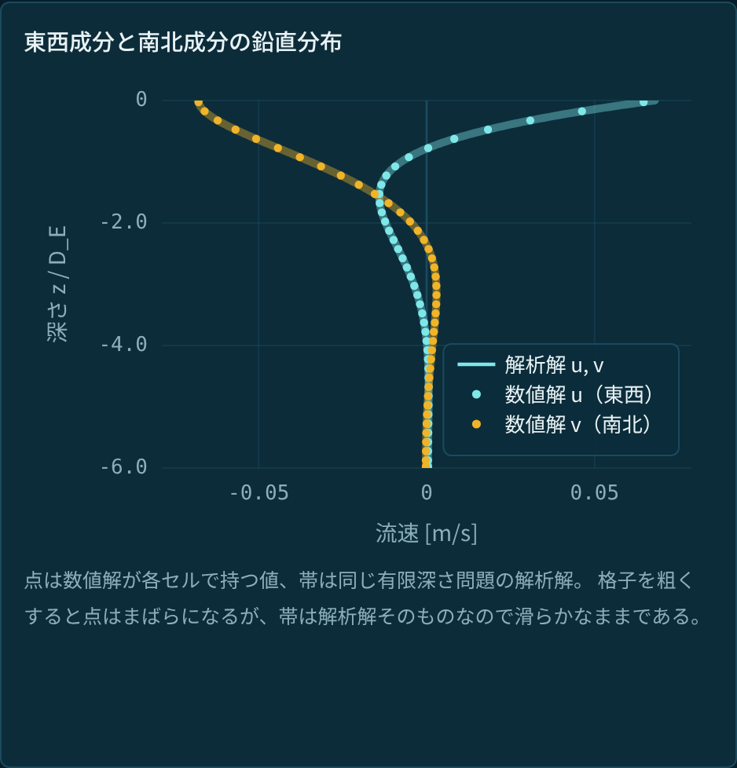
  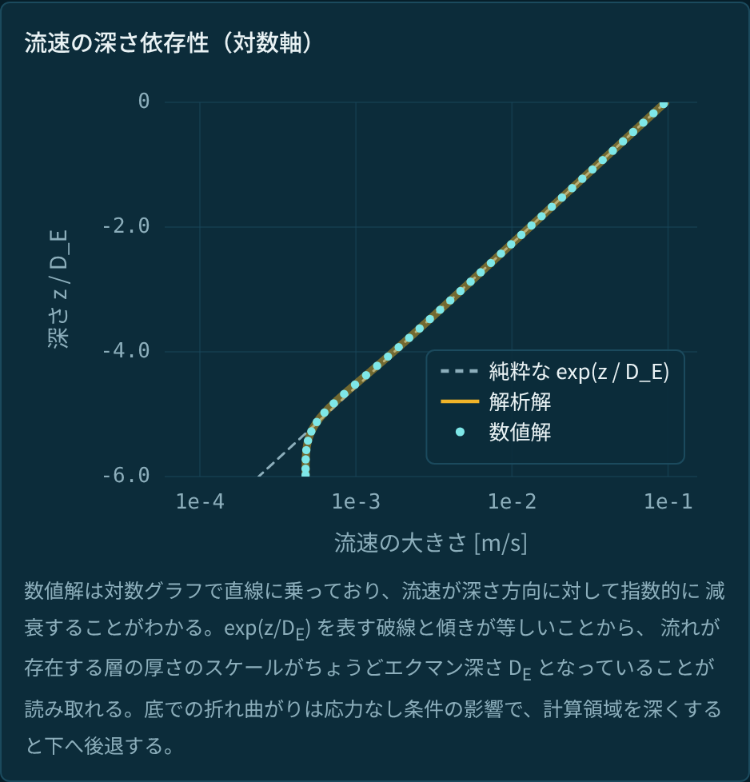
  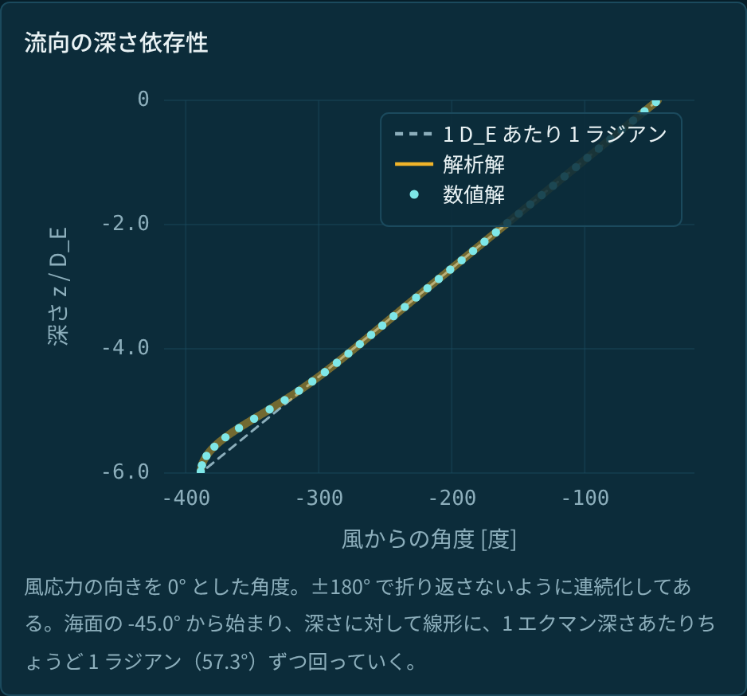
</p>

中央の図は縦軸が深さ、横軸が流速の大きさの**対数**である。
数値解は対数グラフで直線に乗っており、流速が深さ方向に対して指数的に減衰することがわかる。
`exp(z/D_E)` を表す破線と傾きが等しいことから、
流れが存在する層の厚さのスケールがちょうどエクマン深さ `D_E` となっていることが読み取れる。
右の図は流向（風応力からの角度）の深さ依存性で、深さに対して直線、
傾きは 1 エクマン深さあたり 1 ラジアンである。
流速の深さ依存性の傾きが数値解における式 (1.9) の `λ` の実部、
流向の深さ依存性が虚部と対応し、両者が等しいという式 (1.9) の主張の確認になっている。

### 3.2 立ち上がりと慣性振動

静止した海に `t = 0` から風を吹かせ続けるとどうなるかを見る。

<p align="center">
  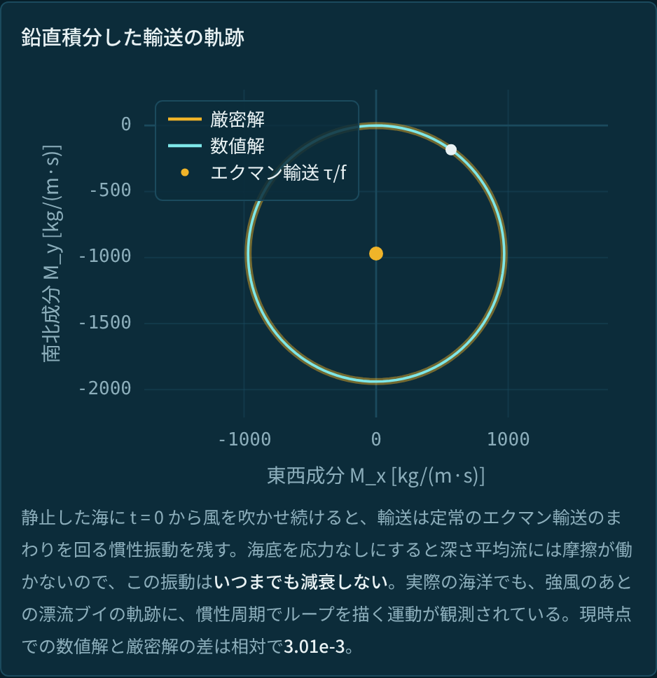
  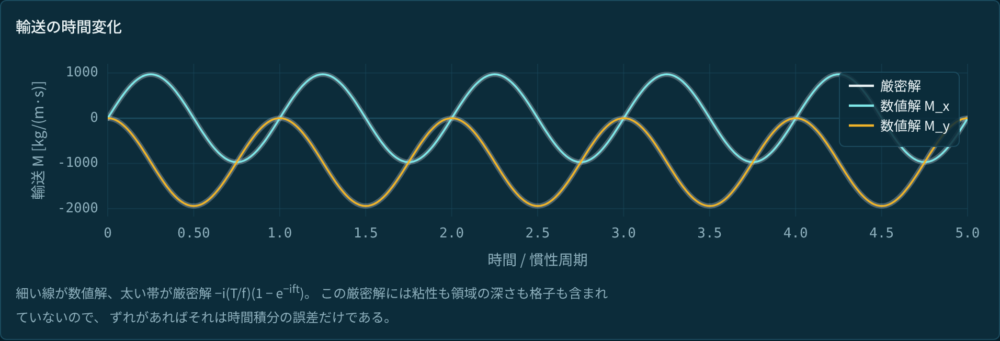
</p>

輸送 `M(t)` は定常のエクマン輸送のまわりを**減衰せずに**回り続ける。
これはバグではない。応力なし条件では海底に摩擦がないので、
深さ平均した流れには摩擦がまったく働かず、慣性振動を減衰させるものが何もないのである。

この慣性振動は実際に観測されている。海面を漂流するブイの軌跡には、
風が急に強まったあとに慣性周期（基準ケースなら 16.9 時間）でループを描く運動が現れ、
低気圧や台風の通過後にはとくに明瞭になる。
ただし実際の海では、海底摩擦や内部波の放射によってエネルギーが抜けるため、
ループは数日のうちに消える。
式 (3.1) がいつまでも回り続けるのは、そうした散逸の経路をこのモデルが持っていないからである。

この振動の厳密解は次のように書ける。

$$
M(t) = -\frac{iT}{f}\left(1 - e^{-ift}\right)
\qquad (3.1)
$$

これは、式 (2.2) の `dM/dt = T − ifM` の解である。
鉛直積分の段階で粘性項が完全に消えてしまうため、式は `ν_z` を含まない。
さらに、`H` も格子も現れない。
このため、慣性振動の解析解と数値解の比較は
**時間積分の誤差だけを切り出して測る**テストになる（§4.3）。

### 3.3 エネルギー収支

<p align="center">
  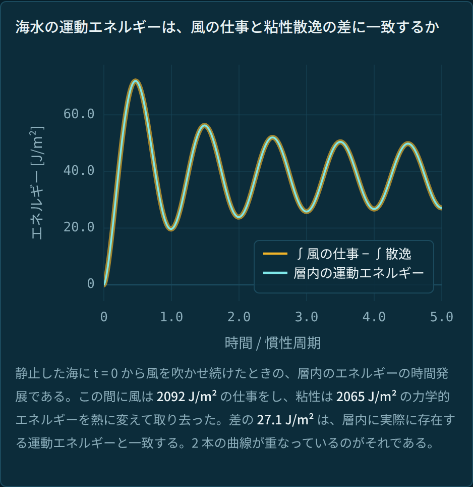
  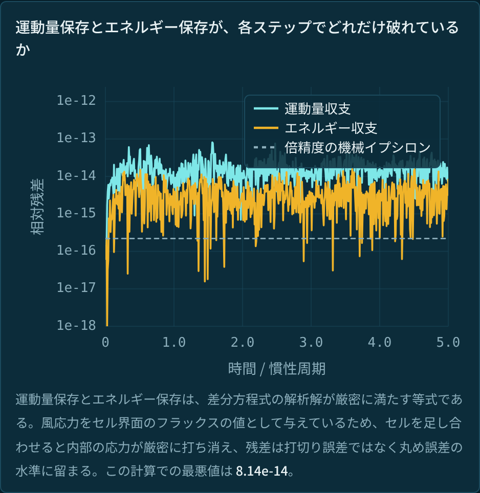
</p>

左図は、静止した海に `t = 0` から風を吹かせ続けた際の海洋の運動エネルギーの時間発展を表す。
この 5 慣性周期のあいだに風は 2092 J/m² の仕事をし、
粘性は 2065 J/m² の力学的エネルギーを熱に変えて取り去った。
差の 27.1 J/m² は、層内に実際に存在する運動エネルギーと一致する
（2 本の曲線が完全に重なっているのがそれである）。

右図は、各ステップで式 (2.2) の運動量収支と式 (2.3) のエネルギー収支が
どれだけ破れているかを表す（縦軸は対数）。
倍精度浮動小数点の丸め誤差（点線、約 2.2×10⁻¹⁶）のすぐ上に張り付いたまま、
時間が経っても増えていかない。

<p align="center">
  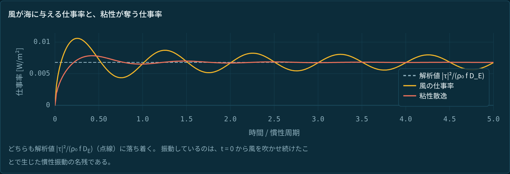
</p>

風の入力と散逸はどちらも解析値 `6.793×10⁻³ W/m²` に落ち着く。
振動しているのは §3.2 の慣性振動の名残である。

### 3.4 エクマン湧昇

貿易風や偏西風のように、風が緯度によって変わる場合を考える。
ここでは `τ_x(y) = τ₀ cos(2πy/L_y)` という南北に対称な風を与えた。

<p align="center">
  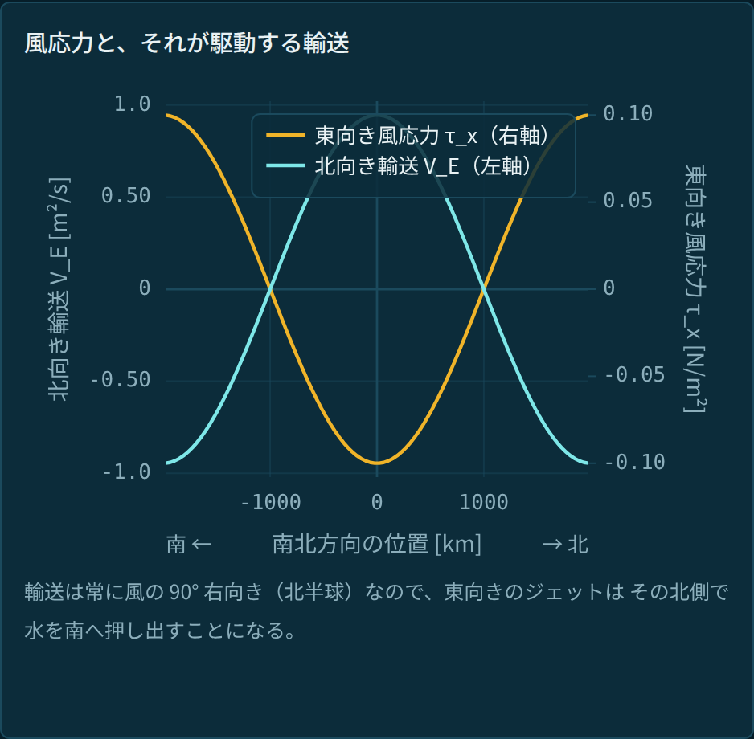
  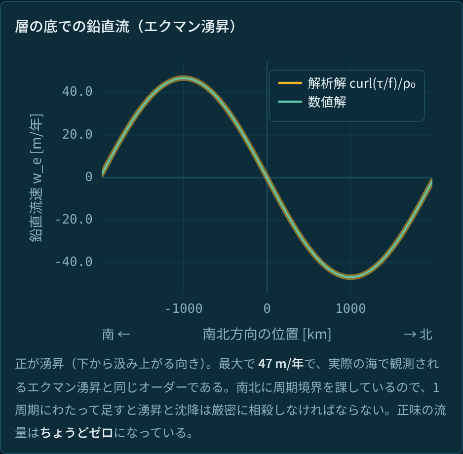
</p>

輸送は各緯度で式 (1.11) に従って風の 90° 右を向くので、風の強さが緯度によって違えば、
隣り合う帯のあいだで運ばれる水の量が食い違う。
水が足りない帯では層の下から汲み上げられ、余る帯では押し下げられる。
この鉛直流速 `w_e` は、質量保存（連続の式）から輸送の水平発散として求まる。

$$
w_e = \frac{\partial U_E}{\partial x} + \frac{\partial V_E}{\partial y}
= \frac{1}{\rho_0}\left[\frac{\partial}{\partial x}\left(\frac{\tau_y}{f}\right) -
\frac{\partial}{\partial y}\left(\frac{\tau_x}{f}\right)\right]
\qquad (3.2)
$$

ここで `U_E`, `V_E` は輸送を密度で割った量 `M/ρ₀` の各成分で、
**単位幅あたりの体積輸送**（単位 m²/s、すなわち「1 m の幅を横切って毎秒何 m³ の海水が流れるか」）である。
最大 46.9 m/年で、実際に観測されるエクマン湧昇と同じオーダーになっている。
海洋生物の生産性が高い海域の多くは、この湧昇によって深層の栄養塩が持ち上げられている場所である。

---

## 4. 検証

### 4.1 検証方針

数値解の妥当性を知るため、次の三点を確かめる。

1. 差分方程式が満たすはずの**保存則**（運動量保存、エネルギー保存など）を
   コードが再現できているか（→ §4.2）。
2. 格子幅 `Δz`・時間刻み `Δt` を細かくした時、領域の深さ `H` を大きくした時、
   誤差が離散化手法から期待される速さでゼロに近づくか（**収束次数**）（→ §4.3, §4.4）。
3. エクマン螺旋（解析解）が満たす主要な**物理的性質**
   （海面で風に対して 45° 右を向く流れ、層全体では 90° 右へ `τ/f` のエクマン輸送）が
   再現できているか（→ §4.5）。

以下はすべて `node tests/verify.mjs` で再現でき、
同じコードがブラウザの「検証」タブでも動く。全出力は
[`docs/verification-output.txt`](docs/verification-output.txt) にある。

```text
$ node tests/verify.mjs
...
  20 項目中 20 項目が合格
$ echo $?
0
```

＜実行例＞

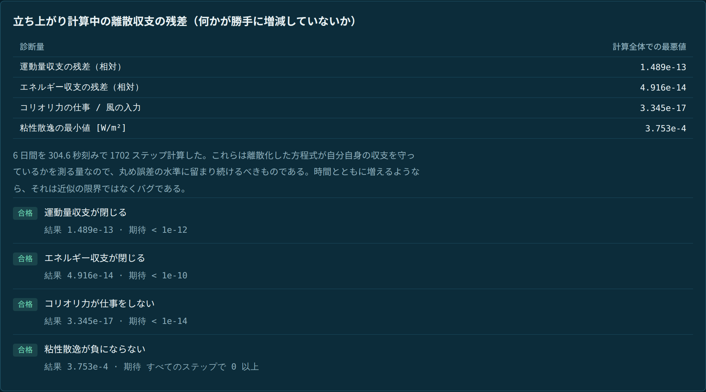

### 4.2 保存則の検証

運動量保存の式 (2.2) とエネルギー保存の式 (2.3) は、
差分方程式 (2.1) の解析解が厳密に満たす等式である。
このため、運動量保存とエネルギー保存が打切り誤差ではなく丸め誤差の水準で成り立つことの確認が、
**差分方程式が正しく実装されているか**の一つの指標になる。
逆に言えば、添字のずれ、境界の扱い、時間積分の組み方のどこかを間違えれば、ここが破れる。

6 日間・1702 ステップの立ち上がり計算中、毎ステップで残差を測ったときの最悪値。
丸め誤差の範囲に留まっている。

| 診断量 | 最悪値 | 期待される値 |
|---|---|---|
| 運動量収支 (2.2) の残差（相対） | `1.489e-13` | 丸め誤差 |
| エネルギー収支 (2.3) の残差（相対） | `4.916e-14` | 丸め誤差 |

### 4.3 離散化の収束次数（`Δz`, `Δt` → 0）

格子幅 `Δz`、時間刻み `Δt` を細かくした時、
誤差が離散化手法から期待される速さでゼロに近づくかを測る。
次数 `p = 2` は「刻み幅を半分にすると誤差が `2^(−p) = 1/4` になる」ことを意味する。
Crank–Nicolson法の 2 次精度が正しく実現していることがわかる
（空間の離散化も同じく 2 次精度である）。
空間収束の比較対象には式 (2.6) の有限深さ厳密解を用いた。

| テスト | 細かくするもの | 参照解 | 測定された次数 |
|---|---|---|---|
| 空間精度（定常解、L2 ノルム） | 格子数 `N`（= 格子幅 `Δz` を半分に） | 式 (2.6) の有限深さ厳密解 | **2.000** |
| 空間精度（定常解、L∞ ノルム） | 同上 | 同上 | **2.000** |
| 時間精度（Crank–Nicolson法） | 時間刻み `Δt` を半分に | 式 (3.1) の慣性振動 | **1.9999** |

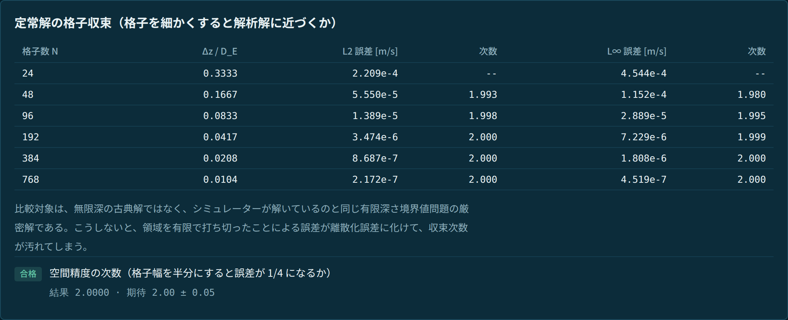

§3.2 の慣性振動の式 (3.1) は渦粘性係数 `ν_z` を含まないため、
時間刻み `Δt` に対する収束性は鉛直格子数 `N` に依存しないはずであり、
実際 `N = 16, 64, 256` のいずれでも誤差が `4.0335e-3` と完全に一致している。

### 4.4 領域の深さの影響（`H` → ∞）

海底を粘着条件にすると底面摩擦が運動量を抜き取るため、鉛直積分した輸送は
無限に深い海での値（式 (1.11) の `τ/f`）より足りなくなる。
この不足分、すなわち**深さ `H` で切った解と `H → ∞` の解析解との差**が、
領域を打ち切ったことによる誤差である。
有限深さの厳密解 (2.6) からはこの差が `sech(λH)`、
`H ≫ D_E` では `2exp(−H/D_E)` になると予測される。実測と並べると次のようになる。

| H / D_E | 相対誤差（`H → ∞` の `τ/f` との差） | 予測値 `2exp(−H/D_E)` | 式 (2.6) との差（＝離散化誤差） |
|---:|---:|---:|---:|
| 3 | 9.931e-2 | 9.957e-2 | 3.4e-5 |
| 4 | 3.662e-2 | 3.663e-2 | 1.7e-5 |
| 6 | 4.955e-3 | 4.958e-3 | 3.4e-6 |
| 8 | 6.705e-4 | 6.709e-4 | 6.2e-7 |

予測される指数関数と 1% 以内で一致している。
**指数的に減衰する**ことが確認できたので、エクマン螺旋を考える上では、
本来非常に深い海を有限の領域で打ち切ってよいと言える。

### 4.5 物理的性質の確認

**海面の偏角が 45° であること（式 1.10）。**
格子を細かくすると 2 次で収束する。
流速はセルの中心に対して定義されていて、海面に相当する最上部のセルの上面の値はないので、
最も細かい 2 つの格子から Richardson 外挿
（有限の格子数で得た値から格子幅ゼロの極限を推定する操作）を行うと `-45.00000000°` になる。

| N | 偏角 [度] | 誤差 [度] | 次数 |
|---:|---:|---:|---:|
| 48 | −44.105045 | 8.950e-1 | — |
| 96 | −44.776193 | 2.238e-1 | 2.000 |
| 192 | −44.944047 | 5.595e-2 | 2.000 |
| 384 | −44.986012 | 1.399e-2 | 2.000 |
| 768 | −44.996503 | 3.497e-3 | 2.000 |

**正味の水平輸送が式 (1.11) に一致すること。**
応力なし条件では、離散化した方程式の解析解の正味の水平輸送が、
元の偏微分方程式の解析解の輸送（エクマン輸送）と一致する（§2.5）。
実際の計算でも、得られた数値解は偏微分方程式の解析解と精度良く一致する。
`N` を 8〜512、`H` を 3〜12 `D_E` で振った 24 通りすべてで `4.235e-14` 以内であり、
値が離散化の粗さに依存しないことが再現できている。

```text
数値解               M = ( 2.900887e-13, -9.696888e+02) kg/(m s)
解析解 (τ_y−iτ_x)/f  M = ( 0.000000e+00, -9.696888e+02) kg/(m s)     相対差 1.784e-15
```

### 4.6 検証結果一覧（20 項目、すべて合格）

基準パラメータは北緯 45°（`f = 1.031×10⁻⁴ s⁻¹`）、`ν_z = 10⁻² m²/s`、`ρ₀ = 1025 kg/m³`、
`τ_x = 0.1 N/m²`（東向き）、海底は応力なし、時間積分は Crank–Nicolson法。
格子数 `N`・深さ `H`・時間刻み `Δt` は項目ごとに変えており、
収束次数を測る項目はこれらを系統的に振った結果である（項目 18 のみ前進Euler法）。

表中の「定常」は、同じ風が吹き続けて流れが時間変化しなくなった状態（`∂W/∂t = 0`）を指す。
倍精度浮動小数点のマシンイプシロンは `2.2×10⁻¹⁶` である。
「丸め誤差のオーダー」とは、この数を計算のステップ数だけ積み上げた程度の大きさという意味である。

| # | 項目 | 結果 | 合格の理由（判定基準） |
|---:|---|---|---|
| 1 | 空間精度の次数（格子幅を半分にすると誤差が 1/4 になるか） | 2.0000 | 設計どおりの 2 次精度（`2.00 ± 0.05`） |
| 2 | 海面の偏角（Richardson 外挿） | −45.000000° | 解析値 −45° と小数第 5 位まで一致 |
| 3 | 偏角の収束次数（格子数 `N`） | 2.0000 | 2 次精度（`2.00 ± 0.10`） |
| 4 | 輸送が式 (1.11) と一致 | 1.784e-15 | 丸め誤差のオーダー（判定は `< 1e-12`）＝離散的に厳密 |
| 5 | 輸送が N・H によらない（24 格子） | 4.235e-14 | 丸め誤差のオーダー（`< 1e-11`） |
| 6 | 粘着条件の打切り誤差が `2exp(−H/D_E)` に従う | 2.617e-3 | 予測式と相対 1% 以内 |
| 7 | 深さ有限の厳密解 (2.6) との一致 | 3.413e-5 | 空間離散化誤差 `O(Δz²)` の範囲（`< 1e-4`） |
| 8 | 運動量収支 (2.2) が閉じる | 1.489e-13 | 丸め誤差のオーダー（`< 1e-12`） |
| 9 | エネルギー収支 (2.3) が閉じる | 4.916e-14 | 丸め誤差のオーダー（`< 1e-10`） |
| 10 | コリオリ力が仕事をしない | 3.345e-17 | マシンイプシロン以下（`< 1e-14`）＝項ごとに厳密ゼロ |
| 11 | 粘性散逸が負にならない | 3.753e-4 W/m² | 全ステップで正、符号が定義どおり |
| 12 | 時間精度の次数（時間刻みを半分にすると誤差が 1/4 になるか） | 1.9999 | 設計どおりの 2 次精度（`2.00 ± 0.05`） |
| 13 | 時間誤差が鉛直格子の細かさによらない | 1.177e-12 | 丸め誤差のオーダー（`< 1e-9`）＝空間誤差の混入なし |
| 14 | 定常状態で風の入力＝散逸（離散） | 1.163e-14 | 丸め誤差のオーダー（`< 1e-12`） |
| 15 | 海面の半セル分を補正した入力と散逸の一致 | 1.149e-14 | 丸め誤差のオーダー（`< 1e-12`） |
| 16 | 仕事率の解析値への収束次数（格子数 `N`） | 2.0001 | 2 次精度（`2.00 ± 0.10`） |
| 17 | Crank–Nicolson法がコリオリ回転だけを解いたときエネルギーを保存 | 9.770e-15 | 丸め誤差のオーダー（`< 1e-12`）＝増幅率がちょうど 1 |
| 18 | Euler法による流速絶対値 `\|W\|` の増加が増幅率の式 (2.4) と一致するか | 1.540e-14 | 予測式と相対 `1e-3` 以内（実測は丸め誤差の水準） |
| 19 | 湧昇速度の収束次数（南北格子数 `Ny`） | 1.9999 | 2 次精度（`2.00 ± 0.05`） |
| 20 | 湧昇と沈降の相殺 | 5.604e-17 | マシンイプシロン以下（`< 1e-14`） |

---

## 5. 動かし方

```bash
node tests/verify.mjs        # 検証スイート（依存パッケージなし、数秒で終わる）
python3 -m http.server       # → http://localhost:8000 を開く
```

ES modules を使っているので `file://` では動かず、HTTP で配信する必要がある。
依存パッケージ・ビルド工程はなく、すぐに動作する。

## 6. ファイル構成

```text
index.html            ページ本体（レイアウトとデザイントークン）
src/solver.js         格子、三重対角作用素、Crank–Nicolson法 / Euler法の積分器
src/analytic.js       解析解（螺旋・輸送・立ち上がり・定常仕事率）
src/diagnostics.js    離散の輸送・エネルギー・散逸・収支残差
src/upwelling.js      緯度依存の風とエクマン湧昇
src/checks.js         検証スイート本体（結果をデータとして返す）
src/complex.js        複素数演算のヘルパー
src/plot.js           canvas 描画
src/app.js            UI と作図
tests/verify.mjs      src/checks.js の結果を整形して表示するだけの CLI
```

`tests/verify.mjs` とブラウザは**どちらも `src/checks.js` を import しており**、
README に記載した数値は Web アプリの「検証」タブから確認できるものと同じである。

## 7. AI の利用について

この課題は AI の活用を前提としており、実際に設計・実装・検証のほぼ全工程で
Claude Opus 5（Anthropic）を対話的に使った。役割分担はおおよそ次のとおり。

**人間（西野）が担ったこと**

- **問題設定のスケッチ** — 偏西風が吹くエクマン層の方程式を解き、数値解の検証を
  「運動量・エネルギーが勝手に増えていないこと」「流れが螺旋状であり、海面で風に対して
  右斜め 45 度の流速があり、鉛直積分した際の全体的な右向きへのエクマン輸送量が
  解析解とよく一致すること」で行うという判断。
- **Web アプリの動作検証・可視性向上** — 表示されていない部分を AI に伝えて直し、
  凡例を大きく、カラーコントラストを大きく、文字は大きく、線は太く、矢印を追加する、
  南北を一目でわかるようにするといった改良。
  各タブの解説文と図のキャプションについても、README と同様に文言を修正した。
- **README の全面修正・可読性向上** — Opus 5 が生で生成する文章は「舌っ足らず」で
  初心者に不親切なので、本文の過半に手を加え、各所を補足・削除しつつ
  章構成・章タイトルを修正して可読性を向上した。
  各所の論理の飛躍と誤謬も可能な範囲で修正した。

**AI（Opus 5）が担ったこと**

- **設計** — 境界条件の与え方、離散化の方針、「正しさの根拠」として何を用意すべきか。
  風応力をゴーストセルではなく界面フラックスとして与えると収支が厳密に閉じる（§2.2）、
  という実装方針。
- **実装** — 数値解法の本体、解析解、診断、検証スイート、UI のコード生成。
- **検証** — 20 項目のテスト設計と、失敗したテストの原因切り分け・修正。

## 8. 参考文献

- V. W. Ekman (1905), *On the influence of the Earth's rotation on ocean currents*,
  Arkiv för Matematik, Astronomi och Fysik, **2**(11), 1–52.
- 岡顕, 「特別講義 惑星学 IX 海洋学」講義資料, 神戸大学, 2026 年 8 月.
- 谷川享行, 講義資料「惑星系形成過程と圧縮性流体シミュレーション」, 特別講義 惑星宇宙物理学特論, 神戸大学, 2026 年 8 月.

## 付録 A. エネルギー収支 (2.3) の導出

**複素平面における内積と運動エネルギー**

エネルギーの式は、運動方程式に速度を内積で掛けて作る。
実ベクトルなら `ρ₀ du/dt = F` に `u` を内積で掛けて
`(ρ₀/2) d|u|²/dt = u·F`、すなわち「運動エネルギーの変化率 = 力のする仕事率」を得る。
複素表示では 2 つのベクトル `a`, `b` の内積が `Re(ā b)` にあたるので
（実際 `Re(ā b) = a_u b_u + a_v b_v`。ちなみに虚部は外積にあたる）、
「速度を内積で掛ける」操作は**複素共役を掛けて実部を取る**操作になる。

**左辺がエネルギーの時間変化になること**

鍵は次の恒等式で、`|W|² = W W̄` を時間微分すれば出る。

$$
\mathrm{Re}\left(\overline{W}\frac{dW}{dt}\right) = \frac{1}{2}\frac{d|W|^2}{dt}
$$

式 (2.1) の左辺 `ρ₀Δz dW_k/dt` に `W̄_k` を掛けて実部を取ると、この恒等式によって
セル `k` 1 個が持つ運動エネルギー `E_k ≡ (ρ₀Δz/2)|W_k|²` の時間変化になる。

**コリオリ項が落ちること**

`|W_k|²` は実数なので `i|W_k|²` は純虚数であり、その実部はゼロである。

$$
\mathrm{Re}\left[\overline{W_k}\left(-i f \rho_0 \Delta z W_k\right)\right]
= -f \rho_0 \Delta z \mathrm{Re}\left(i |W_k|^2\right) = 0
$$

成分で書けば `u(fv) + v(−fu) = 0`。
他の項との打ち消しではなく、セルごと・項ごとにゼロである。
以上より、セル `k` 1 個については

$$
\frac{dE_k}{dt} = \mathrm{Re}\left[\overline{W_k}\left(\tau_k - \tau_{k+1}\right)\right]
$$

が残る。これは、コリオリ力が流速と直交しており仕事をしないことと整合的である。

**足し上げると差の二乗が現れること（離散的な部分積分）**

全セルについて足すと、運動量のときと同じ打ち消しが起こる。
ただし今度は界面 `j` の応力に差 `W_{j-1} − W_j` が掛かる形で残るため、差の二乗の和が現れる。
実際、離散的な部分積分として

$$
\sum_{k=0}^{N-1} \mathrm{Re}\left[\overline{W_k}\left(\tau_k - \tau_{k+1}\right)\right] =
\mathrm{Re}\left(\overline{W_0}\tau_0\right) -
\sum_{j=1}^{N-1} \mathrm{Re}\left[\overline{W_{j-1}-W_j}\tau_j\right] -
\mathrm{Re}\left(\overline{W_{N-1}}\tau_N\right)
$$

が成り立つ。ここに界面応力 `τ_j = ρ₀ν_z(W_{j-1} − W_j)/Δz` を入れると、
第 2 項の各項は `(ρ₀ν_z/Δz)|W_{j-1} − W_j|²` になる。
境界の `τ_0 = T` と、応力なし条件の `τ_N = 0` を使えば式 (2.3) が得られる
（`Re(W̄_0 T) = Re(T̄ W_0)` である）。

**粘着条件の場合**

海底の界面にも応力が残り、壁までの距離が半セルであることから
`τ_N = 2ρ₀ν_z W_{N-1}/Δz` となるので、上の第 3 項が `ε` に
`2(ρ₀ν_z/Δz)|W_{N-1}|²` を加える。これも二乗なので非負性は保たれる。

## ライセンス

MIT
